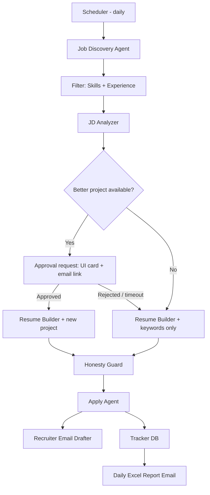

# 🤖 AI Job Copilot (Auto Job Applier)

An AI agent that knows your skills, projects and experience, searches jobs daily across **Naukri, Indeed, LinkedIn and InstaHire**, tailors your resume to each job description, applies on your behalf, and emails you a daily report.

> **Design principle:** *Automate the boring 90%, keep the human in control of the 10% that matters* (new projects, risky actions, anything that could misrepresent you).

---

## 🚀 Quick Start (Phase 1)

Requires Python 3.11+ (3.13 recommended) on Windows, macOS or Linux.

```powershell
# 1. Create the virtual environment and install dependencies
py -3.13 -m venv .venv
.venv\Scripts\activate            # macOS/Linux: source .venv/bin/activate
pip install -r requirements.txt
playwright install chromium

# 2. Configure secrets
copy .env.example .env            # macOS/Linux: cp .env.example .env
#    then set GEMINI_API_KEY (https://aistudio.google.com/apikey) and optionally SMTP_* for email

# 3. Fill in your real data
#    config/profile.yaml   - skills (Verified Skill Bank), projects, experience, preferences
#    config/settings.yaml  - threshold, caps, mode

# 4. Verify everything
python main.py check
```

### Daily use

| Command | What it does |
|---|---|
| `python main.py run --source sample --no-email` | Try the full pipeline offline on `data/sample_jobs.json` |
| `python main.py login naukri` | One-time: log in to Naukri in a visible browser (session is saved) |
| `python main.py run` | Daily run: search Naukri → freshness/dedupe → Gemini JD analysis → score → tailored PDF → report email |
| `python main.py review` | Approve / reject pending jobs, open the tailored resume |
| `python main.py apply --max 5` | Apply to approved jobs (daily + per-portal caps) |
| `python main.py jobs --status pending_review` | List tracked jobs |
| `python main.py report --send` | Build/email today's Excel report |
| `python main.py chat` | Chat with the **Gemini agent**, which drives the copilot through its **MCP tools** |
| `python main.py ask "show my top 5 matches"` | One-shot question to the agent |
| `python main.py mcp` | Run the MCP server over stdio for any MCP client |

### MCP server

`job_copilot/mcp_server.py` exposes the copilot as MCP tools: `get_profile_summary`, `list_jobs`, `get_job`,
`run_job_search`, `analyze_job_description`, `add_job_manually`, `approve_job`, `reject_job`,
`apply_approved_jobs`, `generate_daily_report`, `skill_gap_report`, `update_project_description`
(guarded by the Honesty Guard), plus the `profile://yaml` resource.

The built-in Gemini agent uses it automatically. To use it from another MCP client (Claude Desktop, Claude Code, Cursor), add:

```json
{
  "mcpServers": {
    "job-copilot": {
      "command": "C:\\Automation Job Agent\\.venv\\Scripts\\python.exe",
      "args": ["-m", "job_copilot.mcp_server"],
      "cwd": "C:\\Automation Job Agent"
    }
  }
}
```

### Code layout

```
config/            profile.yaml (source of truth), settings.yaml
job_copilot/
  llm/gemini.py    Gemini client (API key, structured JSON output, retries)
  agents/          freshness, skill_bank, jd_analyzer, matcher, honesty_guard,
                   resume_builder (Jinja2 → PDF via Playwright), reporter (Excel), emailer (SMTP)
  portals/         base interface, naukri (Playwright), sample (offline test data)
  pipeline.py      daily run orchestration
  mcp_server.py    MCP tools
  gemini_agent.py  Gemini ↔ MCP agent (chat / ask)
  db.py            SQLite tracker (storage/tracker.db)
templates/         resume.html.j2
storage/           resumes (+ JSON vault with JD & diff), reports, browser sessions (git-ignored)
tests/             pytest
```

Without `GEMINI_API_KEY` the pipeline still runs with heuristic JD analysis and no rewriting, which is useful for testing.

---

## ✨ Features

### 1. Profile Brain (Single Source of Truth)
- Stores everything about you: skills, projects (with GitHub links), learning goals, experience, preferences.
- **Experience is locked** – the agent can never edit it.
- **Editable by agent (within limits):** project descriptions and skill keywords.
- Preferences: locations, salary range, notice period, role titles, blacklisted companies.

### 2. Job Discovery & Filtering
- Searches each portal daily using your target roles.
- Filters by:
  1. **Freshness** – only jobs **posted within the last 7 days** (`max_job_age_days: 7`). Older or undated postings are skipped.
  2. **Skills match** (mandatory vs. nice-to-have skills)
  3. **Experience match** (years required vs. yours)
- Freshness is checked **twice**: first via the portal's own "Last 7 days" filter (fewer pages to scan), then again by parsing the posting date on the job page, because portal filters can be unreliable. Relative dates ("3 days ago", "Just now", "30+ days ago") are converted to absolute dates in IST.
- If the posted date can't be determined, the job is **skipped** (configurable) and logged.
- Produces a **Match Score (0-100)**. Only jobs above your threshold (e.g. 70) proceed.
- De-duplicates the same job across portals and skips jobs already applied to.

### 3. Smart Resume Tailoring
1. Extract the job description (JD) and pull out mandatory skills and keywords.
2. Compare against your **Verified Skill Bank**.
3. Apply tailoring rules:
   - **Keyword insertion:** add JD keywords you genuinely have into skills / project descriptions.
   - **Equivalent skills:** if the JD says "cloud (AWS or GCP)" and you know one, the matching term is surfaced (e.g. AWS).
   - **Project description rewrite:** existing projects are re-worded to highlight relevant tech.
4. Save the tailored resume (PDF) to cloud storage → gets a **resume URL**.
5. Email a copy to you.

### 4. New Project Suggestion (Human Approval Required)
If another project of yours fits the JD better than the ones on your resume:
1. Agent creates an approval request, shown **both in the web UI Review Queue and in an email**: *"Job X matches your Project Y. Keywords found: …"* with a resume diff preview.
2. **You Approve (UI button or email link)** → resume is rebuilt with the new project and used for the application. Whichever channel you use first wins; the other copy is marked as decided.
3. **Reject / no decision within the timeout** → agent uses the existing resume + keyword updates only (timeout is configurable, or the job can stay parked until you decide).

### 5. Profile Sync Across Portals
When you update your base resume, add a GitHub project, or update your portfolio, the agent propagates those changes to all connected portal profiles.

### 6. AI-Generated Resume Vault
Every generated resume is stored with version history, the JD it was made for, and a diff versus your base resume, so you can always review what was sent.

### 7. Recruiter Outreach
If a recruiter/employer email is found on the posting, the agent drafts a polished email with the tailored resume attached.
- Default mode: **draft only** (you review and approve in the UI **or via the email approval link** before sending).
- Optional mode: auto-send with a daily cap.

### 8. Daily Report Email
After the daily run, you receive an email with an Excel attachment:

| Portal | Job Title | Company | Employer Email | Employer Phone | Match Score | Resume URL | Status |
|--------|-----------|---------|----------------|----------------|-------------|------------|--------|

---

## 🏗️ Architecture



## 🧰 Suggested Tech Stack

| Layer | Option |
|-------|--------|
| Agent / LLM | Gemini API (`google-genai`, API key) + MCP server for tools |
| Orchestration | Python + LangGraph / simple state machine |
| Browser automation | Playwright (persistent, human-like sessions) |
| Scheduler | cron / GitHub Actions / n8n |
| Database | SQLite or PostgreSQL |
| Resume generation | Jinja2 templates → PDF (WeasyPrint / LaTeX) |
| File storage | Google Drive / S3 (for resume URLs) |
| Email | Gmail API / SMTP |
| Reports | openpyxl / pandas |
| Backend API | FastAPI (REST + SSE for live agent logs) |
| UI / Approvals | Web UI Review Queue (Streamlit for MVP, Next.js later) |
| Email | Approval requests (signed one-time links), daily report, critical alerts |

## 📁 Suggested Project Structure

```
job-copilot/
├── config/
│   ├── profile.yaml        # skills, projects, preferences (source of truth)
│   └── settings.yaml       # thresholds, daily caps, schedules
├── agents/
│   ├── discovery.py
│   ├── jd_analyzer.py
│   ├── resume_builder.py
│   ├── honesty_guard.py
│   ├── applier.py
│   └── emailer.py
├── portals/                # naukri.py, indeed.py, linkedin.py, instahire.py
├── templates/              # resume + email templates
├── storage/                # resumes, logs, reports
└── main.py
```

## ⚙️ Configuration (example)

```yaml
match_threshold: 70
max_job_age_days: 7             # only jobs posted in the last 7 days
skip_if_date_unknown: true      # skip postings with no parsable date
max_applications_per_day: 25
per_portal_cap: 10
mode: review        # review = you approve each apply | auto = fully automatic
locked_sections: [experience, education]
editable_sections: [skills, projects]
send_recruiter_emails: draft_only
blacklist_companies: []
```

## 🛡️ Guardrails (Important)

1. **Honesty Guard** – a keyword/skill is added only if it exists in your Verified Skill Bank (or is an equivalent you've approved). The agent never invents skills, tools, or experience.
2. **Experience lock** – job titles, companies, and dates are read-only.
3. **Keyword stuffing limit** – keywords must read naturally; ATS and recruiters penalise stuffing.
4. **Daily caps & human-like pacing** – avoids account flags and spam.
5. **Review mode first** – run in review mode for 1-2 weeks before enabling full auto.
6. **Kill switch** – one command/email reply to pause everything.
7. **Secure email approvals** – links are HMAC-signed, single-use, expire (e.g. 24h), and open a confirmation page (Approve / Reject button) instead of acting on a plain GET, so email scanners and link previews can't approve by accident. Approval state lives in one `approvals` table shared by UI and email.

## ⚠️ Risks You Should Know

- **Terms of Service:** LinkedIn, Indeed and Naukri restrict automated applying/scraping. Aggressive automation can get your account restricted or banned. Keep volumes low, use your own logged-in session, and prefer "assist" over "blast".
- **No official apply APIs:** portals don't offer public APIs for job seekers, so browser automation is needed and will break when UIs change.
- **CAPTCHAs / OTP / custom screening questions** need human-in-the-loop handling.
- **Employer contact data:** only use contact info that is publicly shown on the posting; don't bulk-scrape or mass-email.

## 🗺️ Roadmap

**Phase 1 – MVP**
- [x] Profile YAML + Verified Skill Bank
- [x] One portal (Naukri) discovery + filtering
- [x] JD analyzer + resume tailoring + PDF + resume URL *(URL is a local file link; Drive/S3 upload still to do)*
- [x] Review mode (you click approve) + tracker + daily Excel email
- [x] MCP server + Gemini agent (chat / ask)

**Phase 2**
- [ ] Indeed, LinkedIn, InstaHire
- [ ] New-project approval flow
- [ ] Recruiter email drafts
- [ ] Profile sync across portals

**Phase 3**
- [ ] Telegram/WhatsApp approvals
- [ ] Analytics dashboard (response rate per resume version)
- [ ] Interview prep + follow-up reminders

## 💡 Bonus Feature Ideas

- **Match score with explanation** – "78%: missing Docker, strong in Python/AWS".
- **Skill-gap report** – most-demanded skills you lack, with learning suggestions.
- **Application tracker** – Applied → Viewed → Interview → Offer / Rejected.
- **Auto follow-up** – polite reminder email after 5-7 days of no response.
- **Cover letter generator** per job.
- **Ghost-job / scam detection** – skip old, repeated or suspicious postings.
- **Resume A/B analytics** – learn which resume variant gets more responses.
- **Salary & location rules**, company blacklist/whitelist.
- **Screening-answer memory** – reuse approved answers (notice period, CTC, relocation).
- **Interview prep pack** – likely questions based on the JD and your projects.
